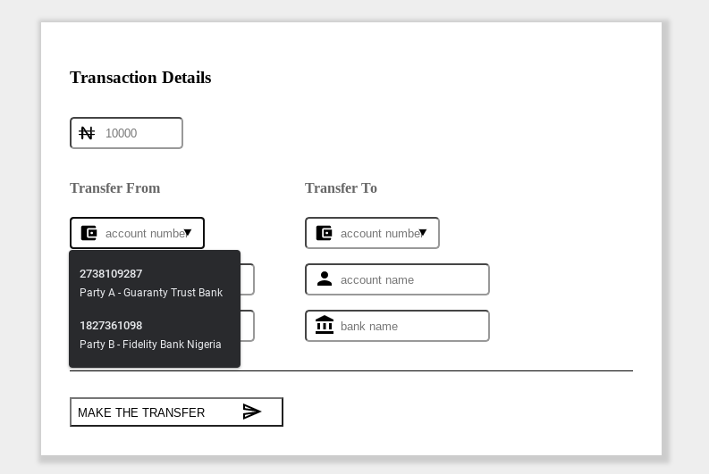

# Fundzz

A codelab to build an inter-bank funds transfer application using Sterling bank APIs in the FSI Sandbox

Live Demo: [https://fundzz.netlify.app/](https://fundzz.netlify.app/)
 
Complete Tutorial: See the lab on [http://codelabs.fsi.ng/](http://codelabs.fsi.ng/)

> See more screenshots in [the screens folder](./src/images/screens)

### To Run/Test It Locally

1.  Clone this repo with and `cd` into the `at-sms-airtime-client-app-js` folder
2.  Run `npm install`
3.  Run `npm run dev`
